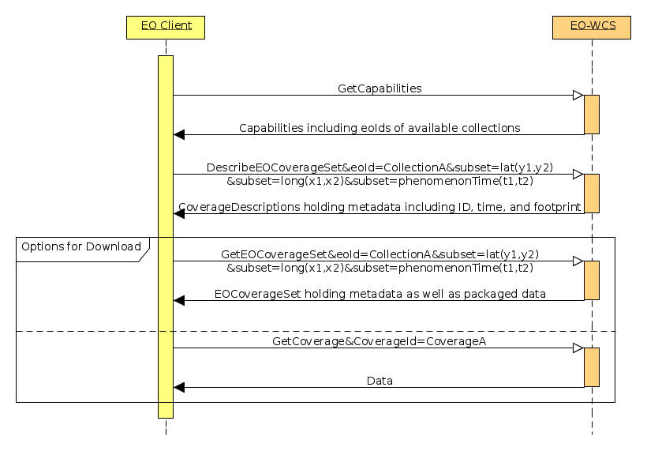
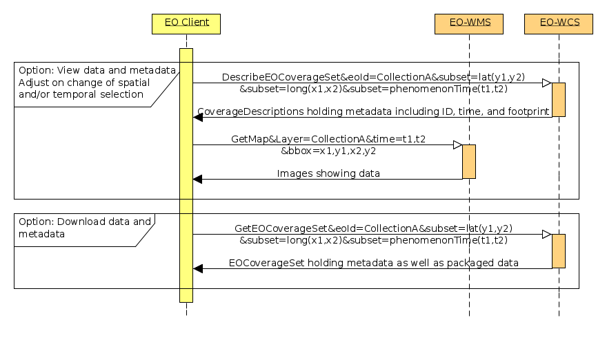

[preface]
== Foreword

This OGC Best Practice document details proposed configuration and
instantiation conventions and recommendations on how to utilize OGC services
for access to Earth Observation (EO) data. These proposed conventions and
recommendations have been developed in the http://www.esa.int/ESA[European
Space Agency (ESA)] funded project
https://wiki.services.eoportal.org/tiki-index.php?page=EVO-ODAS[Evolution of
EO Online Data Access Services (EVO-ODAS)].

It is defined how to utilize OGC's http://www.opengeospatial.org/standards/wcs[
Web Coverage Service (WCS)] with EO products including generic conventions and
recommendations for data and metadata mapping and conversions which are to be
used in concrete tailorings for specific missions. It further considers how to
link to other services like CSW, WMS, and WPS.

Suggested additions, changes, and comments on this draft document are welcome
and encouraged. Such suggestions may be submitted by email message, by creating
an issue or a pull request at the
https://github.com/EOX-A/eo-data-access-bp[GitHub repository], or by making
suggested changes in an edited copy of this document.

_Attention is drawn to the possibility that some of the elements of this
document may be the subject of patent rights. The Open Geospatial Consortium
shall not be held responsible for identifying any or all such patent rights._

_Recipients of this document are requested to submit, with their comments,
notification of any relevant patent claims or other intellectual property
rights of which they may be aware that might be infringed by any implementation
of the standard set forth in this document, and to provide supporting
documentation._

== Introduction

The https://eox-a.github.io/eo-data-access-bp/[Earth Observation Data Access
Best Practice document] at hand provides a detailed look at the access to EO
data from an OGC perspective.

EO data is typically available as raster data or, in OGC terminology, as
coverages. Thus the main OGC service relevant for the data access task is the
http://www.opengeospatial.org/standards/wcs[Web Coverage Service (WCS)] and its
https://schpidi.github.io/eo-wcs/[Earth Observation Application Profile
(EO-WCS)]. Nonetheless further OGC services like the
http://www.opengeospatial.org/standards/wms[Web Map Service (WMS)] and the
http://www.opengeospatial.org/standards/wmts[Web Map Tile Service (WMTS)] for
visualization, the http://www.opengeospatial.org/standards/cat[Catalog Service
(CSW, OpenSearch)] for discovery, or the
http://www.opengeospatial.org/standards/wps[Web Processing Service (WPS)] for
processing need to be taken into account in order to provide a well integrated
solution for data consumers.

=== EO-WCS

The https://schpidi.github.io/eo-wcs/[WCS 2.0 Earth Observation Application
Profile (EO-WCS) [OGC 10-140r2\]] has been adopted by OGC defining a profile of
WCS 2.0 for use on Earth Observation data. Naturally the present document
focuses on EO-WCS but makes sure not to forget the surroundings to put it into
context.

EO-WCS adds some concepts relevant for the EO domain on one side and some
constraints on the other to the generic WCS:

* Specific Earth Observation coverages (<<EO Coverage>> or <<Dataset>>) which
have at least a footprint on Earth as well as a temporal validity extent. Each
<<EO Coverage>> has to have an <<EO Metadata>> set [OGC 10-157r4] contained in
its metadata which describes the coverage on hand on a higher semantic level.

* Heterogeneous groupings or collections of Datasets into  <<Dataset Series>>.
This hierarchy allows for an efficient retrieval of metadata as well as data
via the newly added <<DescribeEOCoverageSet>> and <<GetEOCoverageSet>>
operations respectively.

NOTE: Although named <<Dataset Series>> this concept can and should be used to
group together any <<Dataset,Datasets>>. An example is to group together the
Datasets stemming from a multi-resolution satellite image to form an
<<EO Product>>.

NOTE: <<Dataset Series>> may also include other Dataset Series as well as
<<Stitched Mosaic,Stitched Mosaics>>

NOTE: <<Dataset Series>> themselves are not coverages.

* Homogeneous groupings or collections of spatially non-overlapping subsets of
Datasets into <<Stitched Mosaic,Stitched Mosaics>>.

NOTE: <<Stitched Mosaic,Stitched Mosaics>> are accessible themselves as
coverages.

[#DescribeEOCoverageSet,reftext='DescribeEOCoverageSet']
* DescribeEOCoverageSet operation allowing to retrieve metadata from
collections applying spatial and/or temporal constraints.

[#GetEOCoverageSet,reftext='GetEOCoverageSet']
* GetEOCoverageSet operation allowing to retrieve data from collections
applying spatial and/or temporal constraints.

* Constraint mandatory WCS extensions.

One of the motivations to introduce the concept of <<Dataset Series>> is to
limit the size of capabilities responses. They only need to report the
identifiers of <<Dataset Series>> instead of summaries for all coverages
available. Metadata for individual coverages is obtained using the new
DescribeEOCoverageSet operation. This operation supports basic spatial and
temporal searching as well as paging and thus stepping through the available
data. <<sequence-eo-wcs>> shows the sequence to use EO-WCS.

[#sequence-eo-wcs,reftext='{figure-caption} {counter:figure-num}']
.Sequence diagram showing the exploitation of EO-WCS

=== Further relevant OGC Services

Before downloading data it is typically desired or at least useful to view the
data and metadata. The OGC service standardized for data viewing is the
http://www.opengeospatial.org/standards/wms[Web Map Service (WMS)]. For the EO
domain the http://portal.opengeospatial.org/files/?artifact_id=30912[Web Map
Services - Profile for EO Products (EO-WMS) [07-063r1\]] has been designed.
This WMS profile allows to browse through collections using the time parameter
on one layer. Provided that the same data is available from the EO-WCS Dataset
Series and the EO-WMS collection layer a combined exploitation of EO-WCS and
EO-WMS as shown in <<sequence-eo-wms-eo-wcs>> is feasible.

[#sequence-eo-wms-eo-wcs,reftext='{figure-caption} {counter:figure-num}']
.Sequence diagram showing the combined exploitation of EO-WCS and EO-WMS

Of course the WMS in this scenario can easily be replaced by the
http://www.opengeospatial.org/standards/wmts[Web Map Tile Service (WMTS)]
specifically designed to improve the performance of WMS.

Further OGC standardized services to take into account are the
http://www.opengeospatial.org/standards/cat[Catalog Service (CSW, OpenSearch)]
for discovery, the
https://portal.opengeospatial.org/files/?artifact_id=55210[Download Service for
Earth Observation Products Best Practice (DS-EO) [13-043\]] as well as the
http://www.opengeospatial.org/standards/wps[Web Processing Service (WPS)].

=== Topics Covered

Centered around EO-WCS this Best Practice document defines conventions and
makes recommendations for the following topics:

* <<cross-service-interaction,Cross Service Interaction>> - Detailing how to
structure the data offered in the various services as well as how to explicitly
link between those services. The OGC services under consideration are:
OpenSearch, WMS, WMTS, WCS, and DS-EO.
* <<rangetype-description-enhancements,rangeType Description Enhancements>> -
Designing usage and utilization of how to describe the range values of
products.
* <<collection-and-product-registration,Collection and Product Registration>> -
Drafting an HTTP REST API for programmatic collection and product registration.
* <<coverage-collections,Grouping of Coverages and Associated Data>> - Adding
support for typical EO concepts like multi-resolution products or cloud masks
to OGC services.
* <<condense-coverage-description-information,Condense Coverage Description
Information>> - Applying performance optimizations to facilitate and enable
modern web based applications.
* <<wcs-masking-extension,WCS Masking Extension>> - Proposing support for
retrieving non-rectangular subsets of coverages from WCS.
